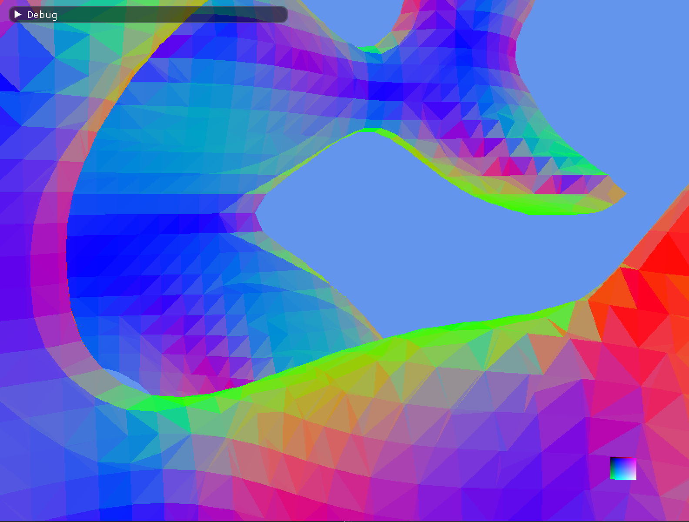
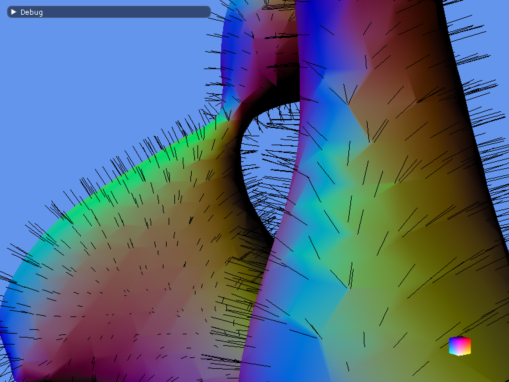
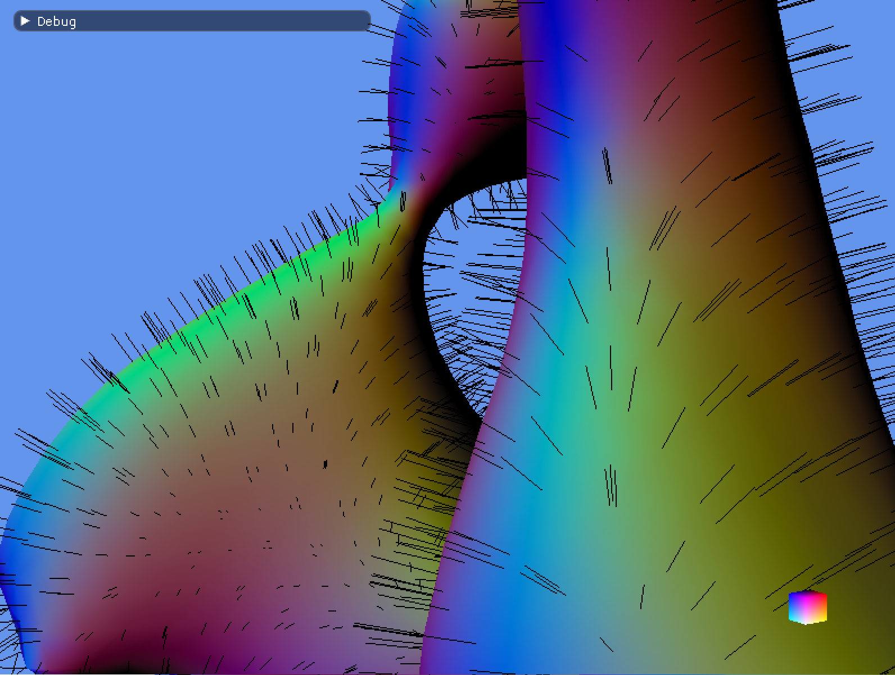

# sdl-bgfx-imgui-marching-cubes

## Archived

__Note__: This project has been migrated to [this](https://github.com/pr0g/sdl-bgfx-imgui-as_1d-nonlinear-transformations) repo as a separate scene and will be maintained there.

## Overview

This repo is spawned from [sdl-bgfx-imgui-starter](https://github.com/pr0g/sdl-bgfx-imgui-starter) (please see the original repo for full details on project setup).

`sdl-bgfx-imgui-marching-cubes` is a test-bed for some fun little experiments with marching cubes.
