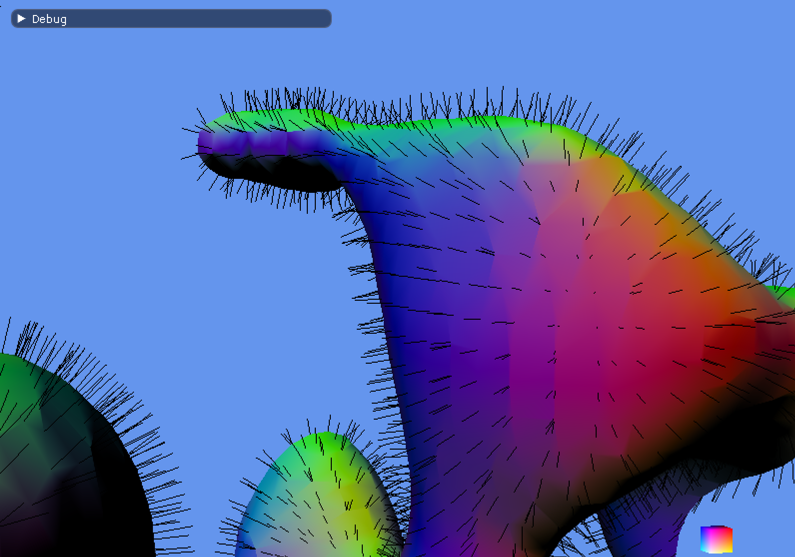

# sdl-bgfx-imgui-marching-cubes

This repo is spawned from [sdl-bgfx-imgui-starter](https://github.com/pr0g/sdl-bgfx-imgui-starter) (please see the original repo for full details on project setup).

`sdl-bgfx-imgui-marching-cubes` is a test-bed for some fun little experiments with marching cubes.
